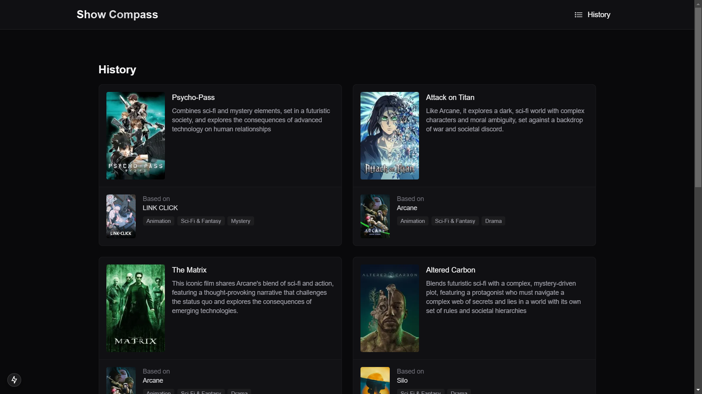
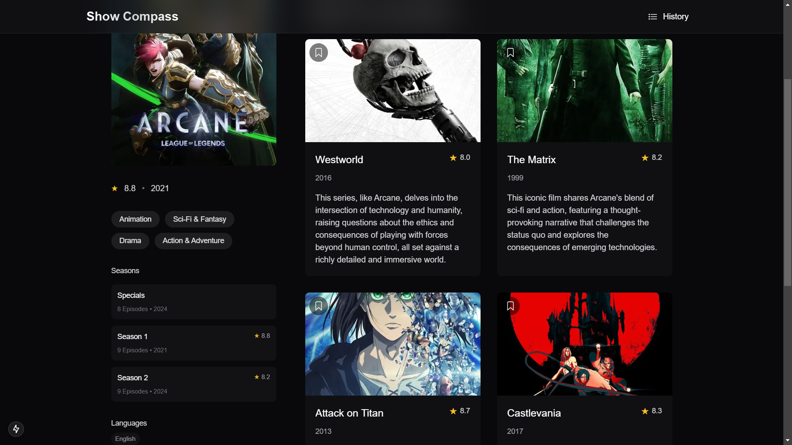
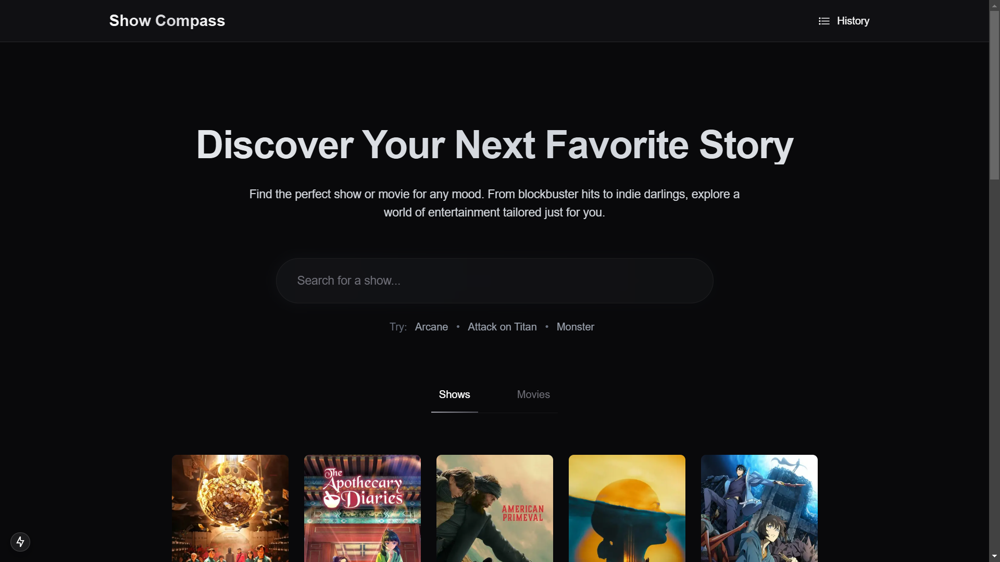

# Show Search App

A modern web application built with Next.js that allows users to search for shows and movies with a sleek, minimalist interface and AI recommendations.

## 🚀 Features

- Real-time search functionality
- Responsive design
- Modern glass-morphism UI
- Dark mode optimized
- AI recommendations
- Save to history

## 💻 Tech Stack

- [Next.js 14](https://nextjs.org/) - React framework
- [Tailwind CSS](https://tailwindcss.com/) - Styling
- TypeScript - Type safety
- [TMDB API](https://www.themoviedb.org/documentation/api) - Movie and TV show data
- [groq](https://groq.com/) - AI recommendations

## 🛠️ Installation

1. Clone the repository:

```bash
git clone https://github.com/yourusername/show-search-app.git
```

2. Install dependencies:

```bash
npm install
# or
yarn install
# or
pnpm install
```

3. Run the development server:

```bash
npm run dev
# or
yarn dev
# or
pnpm dev
```

4. Open [http://localhost:3000](http://localhost:3000) with your browser to see the result.

## 🔧 Environment Variables

Create a `.env.local` file in the root directory and add the following variables:

```env
NEXT_PUBLIC_TMDB_API_KEY=your_tmdb_api_key
NEXT_PUBLIC_GROQ_API_KEY=your_groq_api_key
NEXT_PUBLIC_TMDB_IMAGE_URL=https://image.tmdb.org/t/p/w500
```

## 📝 Usage

1. Open the application in your browser
2. Type in the search bar to find shows
3. Results will appear in real-time as you type

## 📱 Screenshots







## 🤝 Contributing

Contributions, issues, and feature requests are welcome! Feel free to check the [issues page](https://github.com/harryarrouida/show-compass/issues).

---

Built with ❤️ by [Harry Arrouida](https://github.com/harryarrouida)
